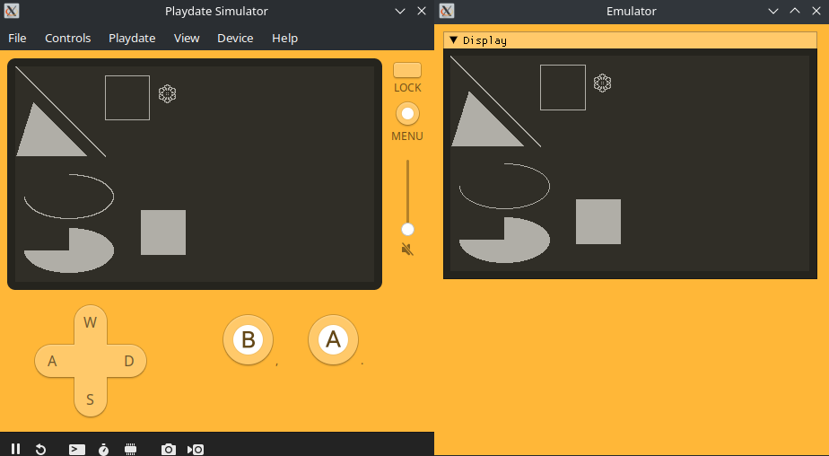
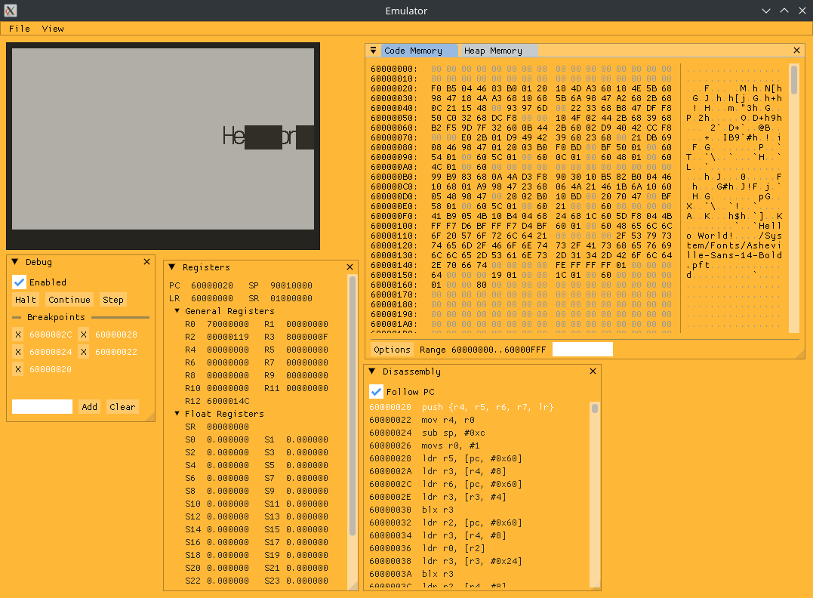

# Cranked

## About
Seeing the lack of an open source Playdate emulator, this seemed like a good opportunity to be the first to reverse engineer and 
reimplement the platform. Most of the file formats had already been reverse engineered, but little in the way of actually loading
and running games (See [Sources](#sources) for reference materials). 
Much of the functionality is missing, such as sprites, audio, and graphical effects, and very little is tested thoroughly, but 
the groundwork is laid and Lua or native programs can be run. See `Runtime.cpp` and `LuaRuntime.cpp` for implemented API functions
and todo items. Expect many crashes.

## Screenshots
### From C

### From Lua

### Native Debugging


## Building
Libraries are all embedded as submodules except for SDL2, which is required for building desktop targets.

Recursively clone the repo with: `git clone --recursive https://github.com/TheLogicMaster/Cranked`.

After installing dependencies, build from the project directory with the following commands (Only tested on Linux):
```
cmake -S . -B build
cmake --build build
```
This should have built the Libretro core and the standalone executable.

## Running Roms
Loading either .pdx directories or .pdx.zip archives is supported (Only .pdx.zip for Libretro core). Run the standalone
executable with the ROM path as the only command-line argument or load the Libretro core like any other. Most programs will
likely crash at the moment and there is little in the way of useful debug output, so debugging from an IDE is best for now.

## Todo
- Sprites
- Graphical effects
- Pattern/stencil drawing
- Polygon, rounded rect drawing
- Perlin noise
- Pathfinding
- Video
- Bitmap Tables
- Audio
- Full font support
- GIF and WAV writing
- Respect all graphical context options like clip rect
- Embed system files like fonts somehow
- Finish C JSON decoding
- Finish C Lua API
- Test building on Windows/Mac
- Create a testing framework to compare console output to the official simulator
- Finish font-ends (Libretro core just crashes at the moment, Desktop has no features, Android only loads a test program)
- Java library with native libs for Android app consumption
- Further investigation for native resource ownership and memory management (Plus Lua sprite/bitmap interactions)
- Scoreboard support
- Investigate Catalog app (Find internal APIs), see if emulator can play encrypted games with a dumped key or something
- System UI/software from SDK
- Investigate pre-2.0.0 binaries to handle uncompressed data
- Emulator API wrapper to hide all the messy internals, possible C compatible
- Values checks, since plenty of null/illegal API parameters will cause a native seg-fault
- Dynarmic native engine support for more portability
- GitHub Actions release builds

## Internals
- Unicorn to provide Arm CPU emulation
- Custom memory allocator to allocate heap memory in a single 32-bit region for easier virtual memory mapping
- C++ template magic plus libFFI to translate calls between emulated Arm, Lua, and C++ natives, handling type marshaling and virtual memory mapping
- Auto-generated 64-bit safe equivalent Playdate API and data structures by parsing the official headers
- Lua objects represented by tables with userdata field and metatables
- Reference counting for shared Lua resources like images and fonts

## GDB Debugging
Requires gdb-multiarch and is run from the project directory with `gdb-multiarch -x gdb_setup`.
- Connect: `target remote localhost:1337`
- Set symbols: `add-symbol-file pdex.elf 0x60000020` (Or add `-ex 'add-symbol-file "pdex.elf" 0x60000020'` to gdb-multiarch command)
- Use normal commands like `break`, `step`, `continue`, `ctrl+c`, etc.

## Updating Submodules
```
git submodule foreach git pull
```

## Libraries and Resources
- [libzippp](https://github.com/ctabin/libzippp)
- [ImGui](https://github.com/ocornut/imgui)
- [Lua54 fork](https://github.com/scratchminer/lua54)
- [Nlohmann Json](https://github.com/nlohmann/json)
- [Unicorn](https://github.com/unicorn-engine/unicorn)
- [Libretro header](https://raw.githubusercontent.com/libretro/libretro-common/master/include/libretro.h)
- [Capstone](https://github.com/capstone-engine/capstone)
- [Bump](https://github.com/kikito/bump.lua)
- [Encoded Asheville Sans 24 Light font from Playdate SDK](https://play.date/dev/)

## Sources
- https://sdk.play.date/inside-playdate
- https://sdk.play.date/inside-playdate-with-c
- https://github.com/jaames/playdate-reverse-engineering
- https://github.com/scratchminer/pd-emu
- https://github.com/ARM-software/abi-aa/blob/2982a9f3b512a5bfdc9e3fea5d3b298f9165c36b/aapcs32/aapcs32.rst
- https://www.lua.org/manual/5.4/
