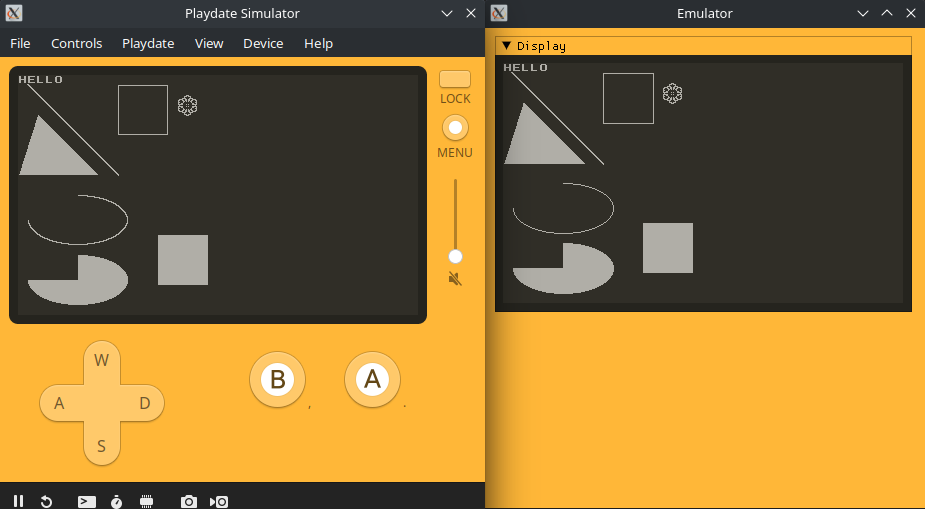

# Cranked

## About
Seeing the lack of an open source Playdate emulator, this seemed like a good opportunity to be the first to reverse engineer and 
reimplement the platform. Most of the file formats had already been reverse engineered, but little in the way of actually loading
and running games (See [Sources](#sources) for reference materials). 
Much of the functionality is missing, such as sprites, audio, and graphical effects, and very little is tested thoroughly, but 
the groundwork is laid and Lua or native programs can be run. See `Runtime.cpp` and `LuaRuntime.cpp` for implemented API functions
and todo items. Expect many crashes.

## Screenshots
### Basic Graphics

### Sprite Collisions

### Native Debugging


## Building
Libraries are all embedded as submodules except for SDL2, which is required for building desktop targets.

Recursively clone the repo with: `git clone --recursive https://github.com/TheLogicMaster/Cranked`.

After installing dependencies, build from the project directory with the following commands (Only tested on Linux):
```
cmake -S . -B build
cmake --build build
```
This should have built the Libretro core and the standalone executable.

## Running Roms
Loading either .pdx directories or .pdx.zip archives is supported (Only .pdx.zip for Libretro core). Run the standalone
executable with the ROM path as the only command-line argument or load the Libretro core like any other. Most programs will
likely crash at the moment and there is little in the way of useful debug output, so debugging from an IDE is best for now.

## Todo
- Finish Sprites (Collision occasionally phases a sprite off-screen in Sprite Collision example)
- Graphical effects
- Pattern/stencil drawing
- Polygon, rounded rect drawing, Mode 7, image rotation and affine transforms
- Audio
- Full font support
- WAV writing
- Respect all graphical context options like clip rect
- Finish C JSON decoding
- Test building on Windows/Mac
- Create a testing framework to compare console output to the official simulator (Graphics, Collisions)
- Finish font-ends (Libretro core just crashes at the moment, Desktop has no features, Android only loads a test program)
- Java library with native libs for Android app consumption
- Scoreboard support
- Investigate Catalog app (Web API already documented)
- Ability to act as simulator
- See if emulator can play encrypted games with a dumped key or something (Maybe limiting to just decrypted games)
- System UI/software from SDK (Create replacement assets, *Darker Grotesque* should be able to be adopted in place of *Roobert* system font)
- Investigate pre-2.0.0 binaries to handle uncompressed data
- Emulator API wrapper to hide all the messy internals, possible C compatible
- Values checks, since plenty of null/illegal API parameters will cause a native seg-fault
- Dynarmic native engine support for more portability
- GitHub Actions release builds
- USB serial functionality (As controller, dump saves, backup games?)
- Better execution model (The current approach works, but has limitations, coroutines might be elegant, avoiding recursive Lua invocation would be good)
- Fix git submodules to not get in detached head state
- Can't currently build in release due to false uninitialized variable errors in Capstone
- Native Cranked API for profiling and such, maybe exposed at a fixed address or at the end of the main PD API struct

## Example Compatibility
(Not all tested yet)
- [x] Hello World
- [x] Sprite Collisions
- [x] Sprite Game
- [x] Particles
- [x] Life
- [ ] Exposure
- [ ] bach.mid
- [x] Array
- [ ] 3D Library (Works until memory bug occurs)
- [ ] Sprite Collision Masks
- [ ] Pathfinder
- [ ] Mode 7 Driver
- [ ] MIDI Player
- [ ] Level 1-1
- [ ] Hammer Down
- [ ] Game Template
- [ ] Flippy Fish
- [ ] Drum Machine
- [ ] Controller Test
- [ ] Asheteroids
- [ ] Accelerometer Test
- [x] 2020
- Single File Examples
  - [ ] Animator
  - [ ] Arcs
  - [ ] Audio
  - [ ] Balls
  - [ ] Blur Dither
  - [ ] Collisions
  - [ ] Crank
  - [ ] Draw Mode
  - [ ] Draw Sampled
  - [ ] Draw Sampled 2
  - [ ] Fade Fast
  - [ ] File
  - [ ] Grid View
  - [ ] Icosohedron
  - [ ] Image Sample
  - [ ] Pachinko
  - [ ] Perlin Distribution
  - [ ] Perlin
  - [ ] Perlin 1
  - [ ] Perlin 2
  - [ ] Perlin 3
  - [ ] Perlin 4
  - [ ] Perlin Fild
  - [ ] Snd Test
  - [ ] Sprite Scaling
  - [ ] Stencil
  - [ ] Synth
  - [ ] Tile Map Test
  - [ ] Wave Table
  - [ ] Zorder

## Internals
- Unicorn to provide Arm CPU emulation
- Custom memory allocator to allocate heap memory in a single 32-bit region for easier virtual memory mapping
- C++ template magic plus libFFI to translate calls between emulated Arm, Lua, and C++ natives, handling type marshaling and virtual memory mapping
- Auto-generated 64-bit safe equivalent Playdate API and data structures by parsing the official headers
- Lua objects represented by tables with userdata field and metatables
- Reference counting for all native resources (Higher memory usage when using many resources such as with fonts)

## GDB Debugging
Requires gdb-multiarch and is run from the project directory with `gdb-multiarch -x gdb_setup`.
- Connect: `target remote localhost:1337`
- Set symbols: `add-symbol-file pdex.elf 0x60000020` (Or add `-ex 'add-symbol-file "pdex.elf" 0x60000020'` to gdb-multiarch command)
- Use normal commands like `break`, `step`, `continue`, `ctrl+c`, etc.

## Profiling
### Building
A built Tracy profiler server is required to view profiled data (Prebuilt releases available for windows).
See [Tracy](https://github.com/wolfpld/tracy) documentation for full instructions and dependencies.
```bash
# Unix building example
cd core/libs/tracy/profiler
mkdir build && cd build
cmake -DLEGACY .. # Legacy flag needed only for X11
make
```
### Usage
Run the Tracy Profiler server and the Cranked client should connect and start streaming data when run. 
All C++ functions which start with a `ZoneScoped` statement will be profiled. Lua code can also be
profiled with `tracy.ZoneBegin()` and `tracy.ZoneEnd()` around code tp be profiled.

## Updating Submodules
```
git submodule foreach git pull
```

## Libraries and Resources
- [libzippp](https://github.com/ctabin/libzippp) for .pdx.zip archives
- [ImGui](https://github.com/ocornut/imgui) for desktop program UI
- [Lua54 fork](https://github.com/scratchminer/lua54) for Lua execution
- [Nlohmann Json](https://github.com/nlohmann/json) for JSON manipulation
- [Unicorn](https://github.com/unicorn-engine/unicorn) for native emulation
- [Libretro header](https://raw.githubusercontent.com/libretro/libretro-common/master/include/libretro.h) for building Libretro core
- [Capstone](https://github.com/capstone-engine/capstone) for disassembly
- [Bump](https://github.com/kikito/bump.lua) for collision handling reference
- [Encoded Asheville SansLight font from Playdate SDK (CC BY 4.0)](https://play.date/dev/) for system font
- [Tracy](https://github.com/wolfpld/tracy) for profiling

## Sources
- https://sdk.play.date/inside-playdate
- https://sdk.play.date/inside-playdate-with-c
- https://github.com/jaames/playdate-reverse-engineering
- https://github.com/scratchminer/pd-emu
- https://github.com/ARM-software/abi-aa/blob/2982a9f3b512a5bfdc9e3fea5d3b298f9165c36b/aapcs32/aapcs32.rst
- https://www.lua.org/manual/5.4/
