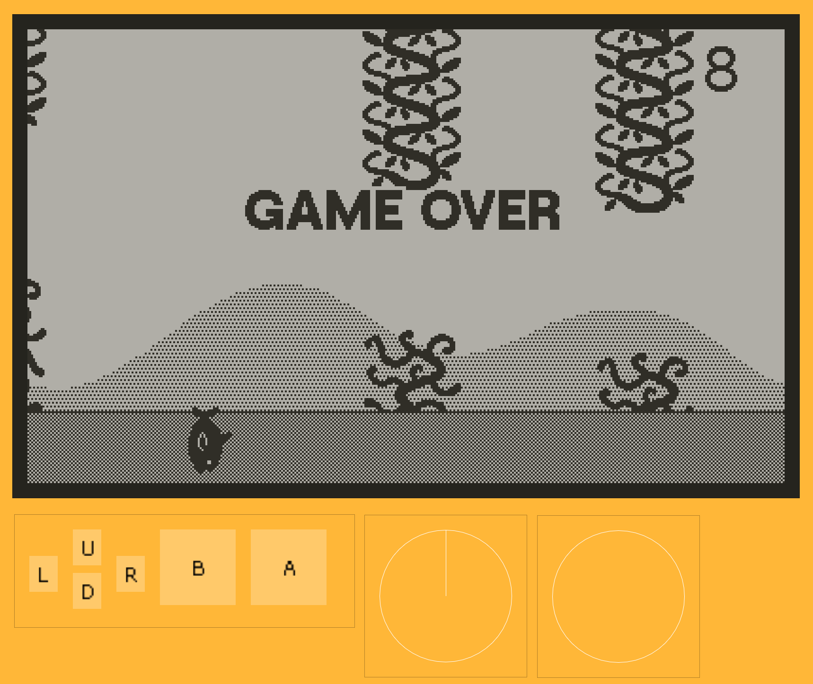
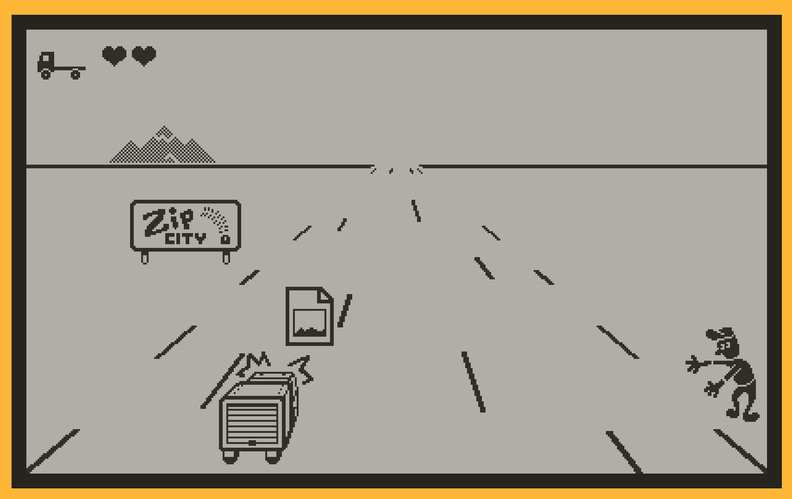
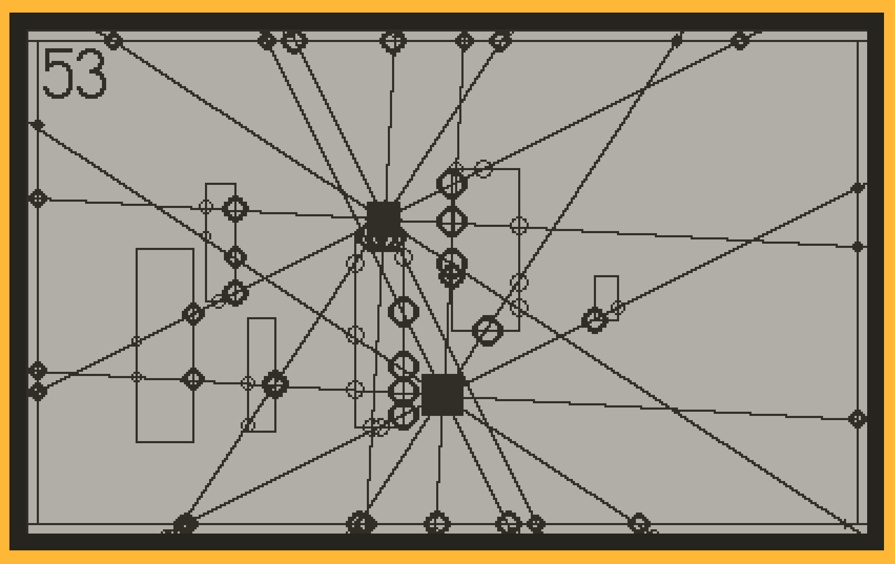
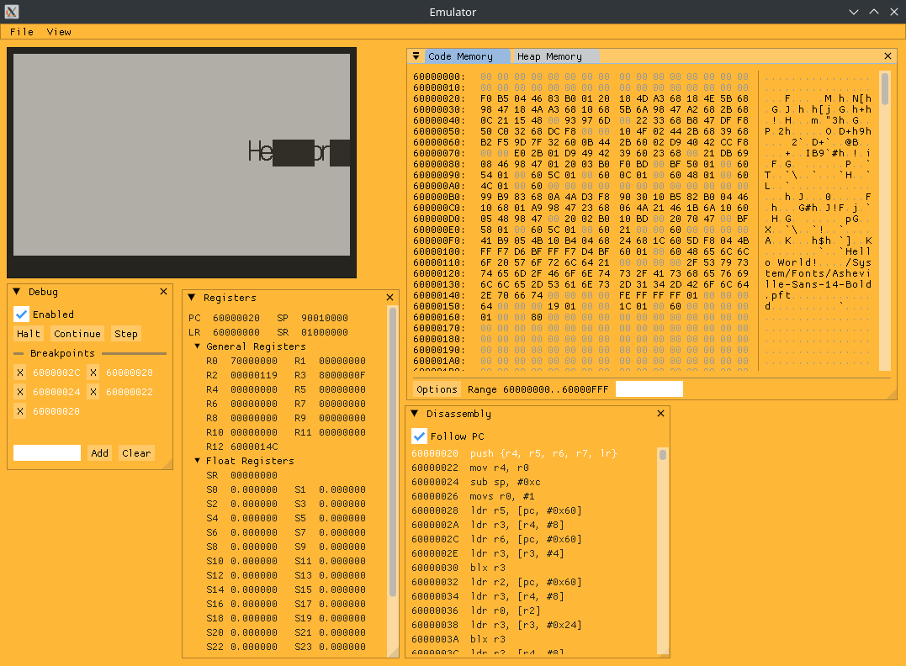

# Cranked
*Cranked* is a work in progress unofficial Playdate Console emulator. This project aims to provide an open source way of running
Playdate console games on a variety of platforms. They Playdate SDK does include a Simulator program for use in development of 
Playdate games, but it is unable to play game compiled for an actual Playdate console and requires a binary to be compiled for 
the native system the simulator runs on. In addition, the official Simulator is only available for the major desktop platform. 
*Cranked* runs actual Playdate games by means of emulating the Arm processor that powers the console. For now, functionality 
is mostly limited to compatible SDK demo programs, but a majority of the Playdate API is implemented at some level (Audio aside). 

## Screenshots
### Flippy Fish

### Hammer Down

### Sprite Collisions

### Native Debugging


## About
This project was started as an excuse to reverse engineer the platform and implement the first working emulator
for said platform. See [Sources](#sources) for other projects which have done much of the initial research into the Playdate
file formats and other interfaces. Development has mostly been done by implementing the API as described by the official
documentation then filling in the gaps and testing by comparing program execution with the official simulator. 

## Building
Libraries are all embedded as submodules except for SDL2, which is required for building desktop targets.

Recursively clone the repo with: `git clone --recursive https://github.com/TheLogicMaster/Cranked`.

After installing dependencies, build from the project directory with the following commands (Only tested on Linux):
```
cmake -S . -B build
cmake --build build
```
This should have built the Libretro core and the standalone executable.

## Running Roms
Loading either .pdx directories or .pdx.zip archives is supported (Only .pdx.zip for Libretro core). Run the standalone
executable with the ROM path as the only command-line argument or load the Libretro core like any other. Most programs will
likely crash at the moment and there is little in the way of useful debug output, so debugging from an IDE is best for now.
There is currently no support for running encrypted ROMs from the Catalog.

## Todo
- Finish Sprites (Collision occasionally phases a sprite off-screen in Sprite Collision example)
- Graphical effects
- Pattern/stencil drawing
- Polygon, rounded rect drawing, Mode 7, image rotation and affine transforms
- Audio
- Full font support
- WAV writing
- Respect all graphical context options like clip rect
- Finish C JSON decoding
- Test building on Windows/Mac
- Create a testing framework to compare console output to the official simulator (Graphics, Collisions)
- Finish font-ends (Libretro core just crashes at the moment, Desktop has no features, Android only loads a test program)
- Front-end should run in a separate thread
- Java library with native libs for Android app consumption
- Scoreboard support
- Investigate Catalog app (Web API already documented elsewhere)
- Ability to act as simulator
- See if emulator can play encrypted games with a dumped key or something (Maybe limiting to just decrypted games)
- System UI/software from SDK (Create replacement assets, *Darker Grotesque* should be able to be adopted in place of *Roobert* system font)
- Investigate pre-2.0.0 binaries to handle uncompressed data
- Emulator API wrapper to hide all the messy internals, possible C compatible
- Values checks, since plenty of null/illegal API parameters will cause a native seg-fault
- Dynarmic native engine support for more portability
- GitHub Actions release builds
- USB serial functionality (As controller, dump saves, backup games?)
- Better execution model (The current approach works, but has limitations, coroutines might be elegant, avoiding recursive Lua invocation would be good)
- Fix git submodules to not get in detached head state
- Can't currently build in release due to false uninitialized variable errors in Capstone
- Native Cranked API for profiling and such, maybe exposed at a fixed address or at the end of the main PD API struct
- LuaRuntime being based on tables rather than userdata is likely to cause incompatibility (Where not tables...) (Already requires patches.lua), and should probably use full userdata from C++
- Better exception handling and stack traces, potentially with disassembled Asm and Lua for context, especially more Lua context, maybe even decompilation
- Lua debugger functionality
- Support Debug Adaptor Protocol like Simulator

## Example Compatibility
- [x] Hello World
- [x] Sprite Collisions
- [x] Sprite Game
- [x] Particles
- [x] Life
- [x] Exposure
- [ ] bach.mid
- [x] Array
- [ ] 3D Library (Works until memory bug occurs)
- [x] Sprite Collision Masks
- [x] Pathfinder (Minor issue with font measuring and family switching for no-path text)
- [ ] Mode 7 Driver
- [ ] MIDI Player
- [ ] Level 1-1 (Basic level loading seems to mostly work, but with tons of graphical issues and no floor, also no audio)
- [x] Hammer Down (No audio)
- [x] Game Template
- [x] Flippy Fish (Display inversion on game over is missing)
- [ ] Drum Machine
- [x] Controller Test
- [ ] Asheteroids (Issue with sprites and Bump, huge memory usage for cells)
- [x] Accelerometer Test
- [x] 2020
- Single File Examples
  - [ ] Animator (Animation of crank-star is messed up at polygon close region, font measuring is wrong, ellipse drawing needs angle normalization)
  - [ ] Arcs (Ellipse drawing needs work)
  - [ ] Audio
  - [ ] Balls (Kinda works until crash)
  - [x] Blur Dither (Text formatting, many graphical differences, un-implemented blur features)
  - [ ] Collisions (Works with poor performance until crash)
  - [x] Crank
  - [x] Draw Mode
  - [ ] Draw Sampled (Mode 7 not implemented)
  - [ ] Draw Sampled 2
  - [x] Fade Fast (Text formatting)
  - [ ] File (Output does not match)
  - [x] Grid View (Text formatting, minor graphical issues)
  - [x] Icosohedron
  - [x] Image Sample
  - [x] Pachinko
  - [x] Perlin Distribution
  - [x] Perlin 1
  - [x] Perlin 2
  - [x] Perlin 3
  - [x] Perlin 4
  - [x] Perlin Field
  - [ ] Snd Test
  - [x] Sprite Scaling
  - [x] Stencil
  - [ ] Synth
  - [x] Tile Map Test
  - [ ] Wave Table
  - [x] Zorder

## Internals
- Unicorn to provide Arm CPU emulation
- Custom memory allocator to allocate heap memory in a single 32-bit region for easier virtual memory mapping
- C++ template magic plus libFFI to translate calls between emulated Arm, Lua, and C++ natives, handling type marshaling and virtual memory mapping
- Auto-generated 64-bit safe equivalent Playdate API and data structures by parsing the official headers
- Lua objects represented by tables with userdata field and metatables
- Reference counting for all native resources (Higher memory usage when using many resources such as with fonts)
- Inheritance of audio classes is actually done use C++ virtual inheritance, which means that all parent class types addresses need to be mapped to account for class layouts

## GDB Debugging
Requires gdb-multiarch and is run from the project directory with `gdb-multiarch -x gdb_setup`.
- Connect: `target remote localhost:1337`
- Set symbols: `add-symbol-file pdex.elf 0x60000020` (Or add `-ex 'add-symbol-file "pdex.elf" 0x60000020'` to gdb-multiarch command)
- Use normal commands like `break`, `step`, `continue`, `ctrl+c`, etc.

## Profiling
### Building
A built Tracy profiler server is required to view profiled data (Prebuilt releases available for windows).
See [Tracy](https://github.com/wolfpld/tracy) documentation for full instructions and dependencies.
```bash
# Unix building example
cd core/libs/tracy/profiler
mkdir build && cd build
cmake -DLEGACY .. # Legacy flag needed only for X11
make
```
### Usage
Run the Tracy Profiler server and the Cranked client should connect and start streaming data when run. 
All C++ functions which start with a `ZoneScoped` statement will be profiled. Lua code can also be
profiled with `tracy.ZoneBegin()` and `tracy.ZoneEnd()` around code tp be profiled.

## Updating Submodules
```
git submodule foreach git pull
```

## Libraries and Resources
- [libzippp](https://github.com/ctabin/libzippp) for .pdx.zip archives
- [ImGui](https://github.com/ocornut/imgui) for desktop program UI
- [Lua54 fork](https://github.com/scratchminer/lua54) for Lua execution
- [Nlohmann Json](https://github.com/nlohmann/json) for JSON manipulation
- [Unicorn](https://github.com/unicorn-engine/unicorn) for native emulation
- [Libretro header](https://raw.githubusercontent.com/libretro/libretro-common/master/include/libretro.h) for building Libretro core
- [Capstone](https://github.com/capstone-engine/capstone) for disassembly
- [Bump](https://github.com/kikito/bump.lua) for collision handling reference
- [Encoded Asheville SansLight font from Playdate SDK (CC BY 4.0)](https://play.date/dev/) for system font
- [Tracy](https://github.com/wolfpld/tracy) for profiling

## Sources
- https://sdk.play.date/inside-playdate
- https://sdk.play.date/inside-playdate-with-c
- https://github.com/cranksters/playdate-reverse-engineering
- https://github.com/scratchminer/pd-emu
- https://github.com/ARM-software/abi-aa/blob/2982a9f3b512a5bfdc9e3fea5d3b298f9165c36b/aapcs32/aapcs32.rst
- https://www.lua.org/manual/5.4/
