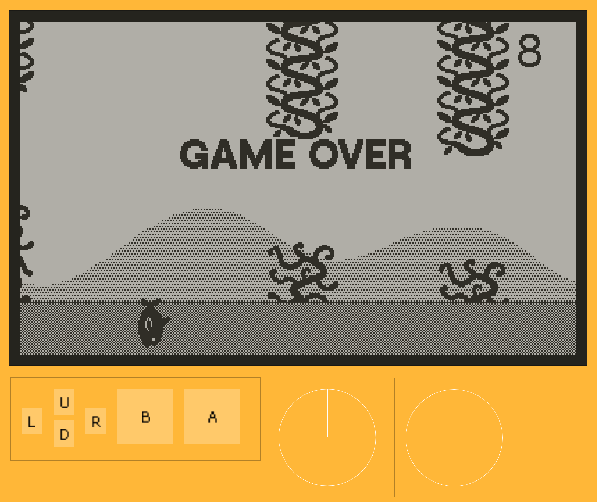
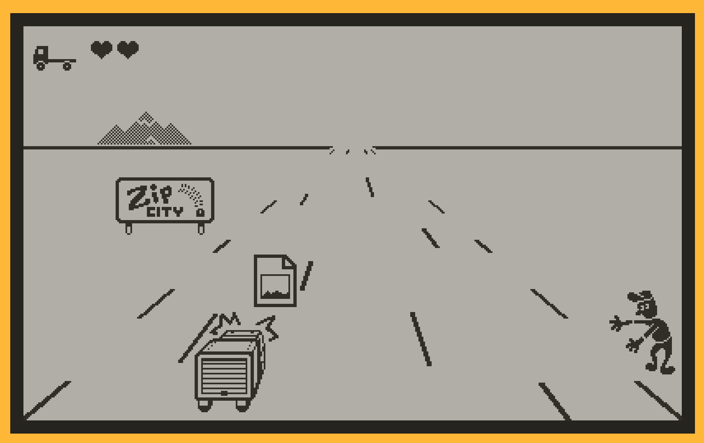
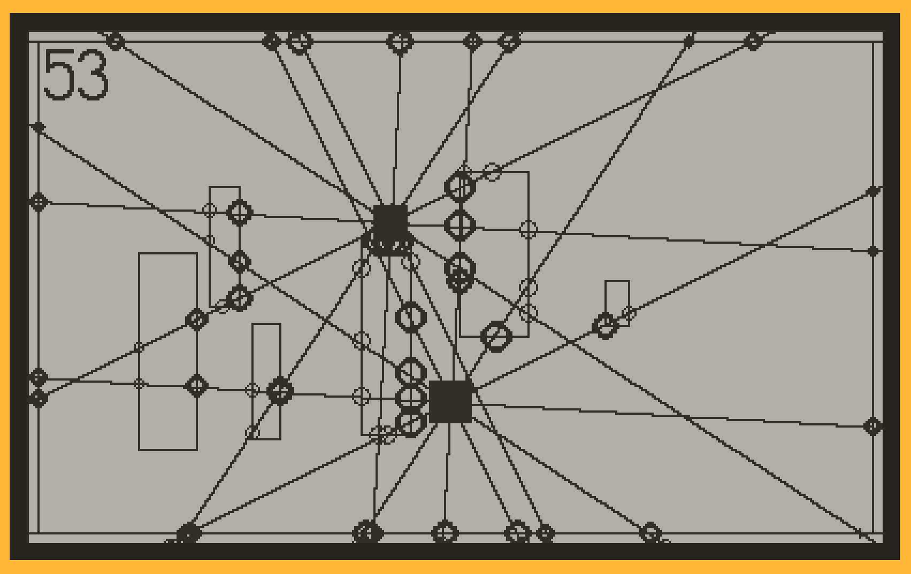
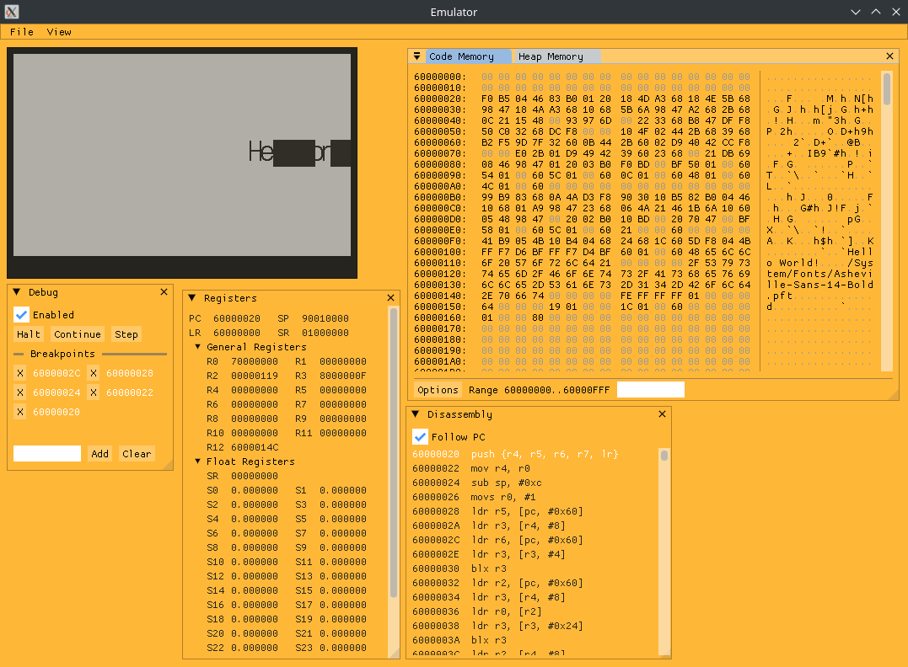

# Cranked
*Cranked* is a work in progress unofficial Playdate Console emulator. This project aims to provide an open source way of running
Playdate console games on a variety of platforms. They Playdate SDK does include a Simulator program for use in development of
Playdate games, but it is unable to play game compiled for an actual Playdate console and requires a binary to be compiled for
the native system the simulator runs on. In addition, the official Simulator is only available for the major desktop platform.
*Cranked* runs actual Playdate games by means of emulating the Arm processor that powers the console. For now, functionality
is mostly limited to compatible SDK demo programs, but a majority of the Playdate API is implemented at some level (Audio aside).

## Screenshots
### Flippy Fish

### Hammer Down

### Sprite Collisions

### Native Debugging


## About
This project was started as an excuse to reverse engineer the platform and implement the first working emulator
for said platform. See [Sources](#sources) for other projects which have done much of the initial research into the Playdate
file formats and other interfaces. Development has mostly been done by implementing the API as described by the official
documentation then filling in the gaps and testing by comparing program execution with the official simulator.

## [Compatibility](docs/Compatibility.md)
See the Compatibility information for tested demos and games.

## [Building](docs/Building.md)
See the Building document for building the project.

## Running Games
Loading either .pdx directories or .pdx.zip archives is supported (Only .pdx.zip for Libretro core). Run the standalone
executable with the ROM path as the only command-line argument or load the Libretro core like any other. Most programs will
likely crash at the moment and there is little in the way of useful debug output, so debugging from an IDE is best for now.
There is currently no support for running encrypted ROMs from the Catalog.

## [Debugging](docs/Debugging.md)
See the Debugging document for how to debug the emulator or running software.

## [Contributing](CONTRIBUTING.md)
See Contributing document for contribution guidelines. See [TODO](docs/TODO.md) for current tasks and priorities.

## Internals
- Unicorn to provide Arm CPU emulation
- Custom memory allocator to allocate heap memory in a single 32-bit region for easier virtual memory mapping
- C++ template magic plus libFFI to translate calls between emulated Arm, Lua, and C++ natives, handling type marshaling and virtual memory mapping
- Auto-generated 64-bit safe equivalent Playdate API and data structures by parsing the official headers
- Lua objects represented by tables with userdata field and metatables
- Reference counting for all native resources (Higher memory usage when using many resources such as with fonts)
- Inheritance of audio classes is actually done using C++ virtual inheritance, which means that all parent class types addresses need to be mapped to account for class layouts

## Updating Submodules
```
git submodule foreach git pull
```

## Libraries and Resources
- [libzippp](https://github.com/ctabin/libzippp) for .pdx.zip archives
- [SDL2](https://wiki.libsdl.org/SDL2) for desktop UI
- [ImGui](https://github.com/ocornut/imgui) for desktop UI
- [Lua54 fork](https://github.com/scratchminer/lua54) for Lua execution
- [Nlohmann Json](https://github.com/nlohmann/json) for JSON manipulation
- [Unicorn](https://github.com/unicorn-engine/unicorn) for native emulation
- [Libretro header](https://raw.githubusercontent.com/libretro/libretro-common/master/include/libretro.h) for building Libretro core
- [Capstone](https://github.com/capstone-engine/capstone) for disassembly
- [Bump](https://github.com/kikito/bump.lua) for collision handling reference
- [Encoded Asheville SansLight font from Playdate SDK (CC BY 4.0)](https://play.date/dev/) for system font
- [Tracy](https://github.com/wolfpld/tracy) for profiling

## Sources
- https://sdk.play.date/inside-playdate
- https://sdk.play.date/inside-playdate-with-c
- https://github.com/cranksters/playdate-reverse-engineering
- https://github.com/scratchminer/pd-emu
- https://github.com/ARM-software/abi-aa/blob/2982a9f3b512a5bfdc9e3fea5d3b298f9165c36b/aapcs32/aapcs32.rst
- https://www.lua.org/manual/5.4/
- https://github.com/adafruit/Adafruit-GFX-Library
