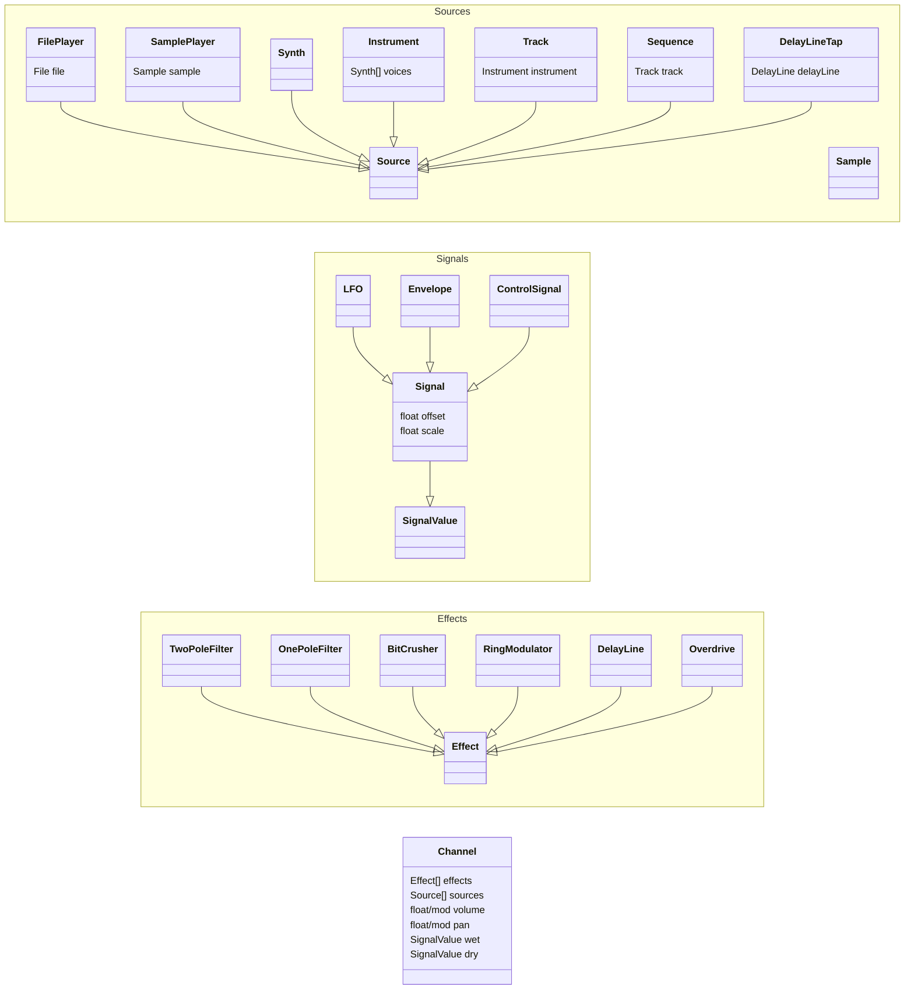

# Audio Diagram

```mermaid
classDiagram
direction RL

class Channel {
    Effect[] effects
    Source[] sources
    float/mod volume
    float/mod pan
    SignalValue wet
    SignalValue dry
}

namespace Sources {

    class Source

    class Sample

    class FilePlayer {
        File file
    }
    
    class SamplePlayer {
        Sample sample
    }
    
    class Synth {
        
    }
    
    class Instrument {
        Synth[] voices
    }
    
    class Track {
        Instrument instrument
    }
    
    class Sequence {
        Track track
    }
    
    class DelayLineTap {
        DelayLine delayLine
    }
}

FilePlayer --|> Source
SamplePlayer --|> Source
Synth --|> Source
Instrument --|> Source
Track --|> Source
Sequence --|> Source
DelayLineTap --|> Source

namespace Signals {

    class SignalValue
    
    class Signal {
        float offset
        float scale
    }
    
    class LFO {
        
    }
    
    class Envelope {
        
    }
    
    class ControlSignal {
        
    }

}

Signal --|> SignalValue
LFO --|> Signal
Envelope --|> Signal
ControlSignal --|> Signal

namespace Effects {

    class Effect
    
    class TwoPoleFilter {
        
    }
    
    class OnePoleFilter {
        
    }
    
    class BitCrusher {
        
    }
    
    class RingModulator {
        
    }
    
    class DelayLine {
        
    } 
    
    class Overdrive {
        
    }

}

TwoPoleFilter --|> Effect
OnePoleFilter --|> Effect
BitCrusher --|> Effect
RingModulator --|> Effect
DelayLine --|> Effect
Overdrive --|> Effect

```
